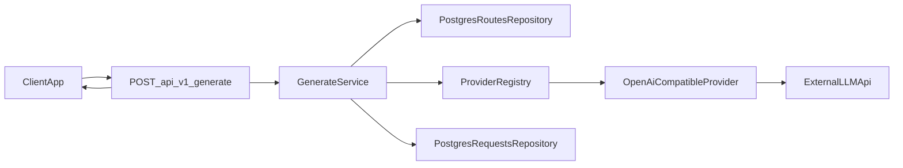

# AI Gateway Architecture

## Назначение

`ai-gateway` в текущей версии — это тонкий внутренний HTTP-сервис, который даёт приложениям одну точку входа для text generation. Клиенты знают только внутренний alias модели и единый endpoint, а gateway сам:

- резолвит alias в реальный provider и внешнюю модель;
- вызывает внешний AI API через provider adapter;
- нормализует ответ в свой внутренний контракт;
- сохраняет историю запроса в PostgreSQL.

Главный принцип MVP: минимальная архитектура без универсального AI-runtime.

## Слои

### HTTP/API

- `POST /api/v1/generate`
- `GET /api/admin/requests`
- `GET /api/admin/requests/:id`
- `GET /api/admin/providers`
- `GET /api/admin/model-routes`
- `GET /health`

HTTP-слой отвечает только за transport, сериализацию JSON и преобразование ошибок в HTTP responses.

### Domain DTO и use case

Внутренний контракт gateway описан в `src/domain/mod.rs`, а сценарий `request -> response` реализован в `src/usecases/generate.rs`.

Use case делает только практические шаги:

1. валидирует запрос;
2. находит alias в `model_routes`;
3. получает provider-конфиг;
4. выбирает adapter по `provider kind`;
5. вызывает внешний API;
6. сохраняет запись в `requests`;
7. возвращает нормализованный ответ клиенту.

### Provider adapters

Внешние LLM API скрыты за `ProviderAdapter`.

Сейчас реализован один adapter:

- `openai-compatible`

Он использует `reqwest` и умеет:

- работать через настраиваемый `base_url`;
- отправлять `chat/completions`;
- забирать usage и finish reason;
- нормализовать ошибки upstream.

### Storage / repository

Хранилище намеренно простое:

- `PostgresRoutesRepository`
- `PostgresRequestsRepository`

Repository-слой не знает про HTTP и не содержит логики вызова провайдера.

### Конфигурация маршрутов

В MVP маршруты и providers хранятся в PostgreSQL, а секреты — в env.

Это даёт удобный компромисс:

- alias и маршруты можно читать через admin API;
- UI позже сможет редактировать эти сущности;
- секреты не попадают в таблицы.

## Поток запроса



## Почему `axum`

Для этого MVP выбран `axum`, потому что он:

- лёгкий и хорошо подходит для простого JSON API;
- естественно работает с `tokio`, `tower` и `tracing`;
- не навязывает тяжёлую архитектуру;
- удобно отдаёт статический admin UI из того же сервиса.

Для тонкого gateway это практичнее, чем строить более тяжёлую серверную обвязку.

## Почему `sqlx`

`sqlx + PostgreSQL` выбраны как минимальный внятный путь для боевого хранения:

- история запросов;
- providers;
- alias routes.

ORM не добавлялся сознательно, чтобы не усложнять модель данных.

## Что уже реализовано

- единый endpoint `POST /api/v1/generate`;
- routing по alias модели;
- один рабочий provider adapter `openai-compatible`;
- хранение истории запросов в PostgreSQL;
- базовый admin API;
- минимальный PrimeVue admin;
- запуск в одном Docker-контейнере с PostgreSQL внутри.

## Что сознательно отложено

- streaming;
- SSE/WebSocket;
- embeddings;
- tools / function calling;
- file upload;
- image generation;
- fallback orchestration;
- auth/roles;
- quotas/billing;
- UI-редактирование providers и routes;
- детальная event-история в отдельной таблице.

## Как добавить нового provider

1. Добавить новый adapter в `src/providers/`.
2. Реализовать `ProviderAdapter`.
3. Зарегистрировать его в `src/main.rs`.
4. Добавить запись в таблицу `providers` с новым `kind`.
5. Привязать alias к этому provider через `model_routes`.

Текущий контракт adapter намеренно узкий: один text generation call без streaming.

## Как добавить новый alias модели

Достаточно добавить строку в `model_routes`, например:

```sql
INSERT INTO model_routes (alias, provider_code, external_model, is_enabled)
VALUES ('cheap-default', 'openai', 'gpt-4.1-mini', TRUE);
```

Клиенты после этого продолжают ходить только в gateway и знают лишь alias.

## Ограничения MVP

- только синхронный сценарий `request -> response`;
- только один реализованный provider kind;
- preview в истории сокращённый и не предназначен для полного аудита;
- для локальной простоты PostgreSQL живёт в том же контейнере, что и приложение;
- текущий UI только читает данные, но не редактирует конфигурацию.
